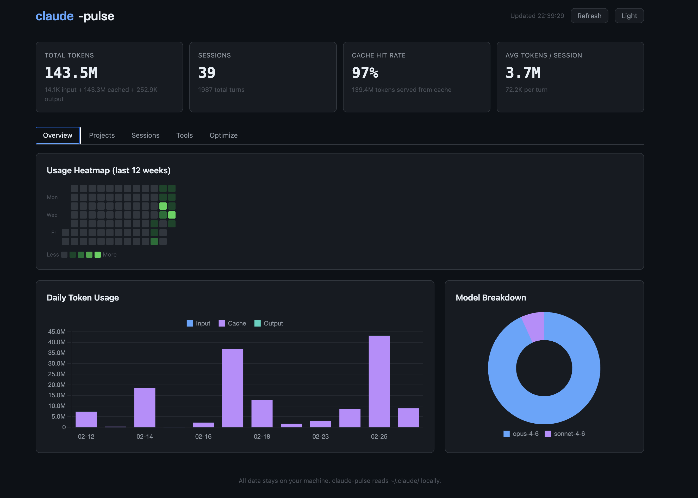

# claude-code-pulse

[](https://www.npmjs.com/package/claude-code-pulse)
[](https://www.npmjs.com/package/claude-code-pulse)
[](https://opensource.org/licenses/MIT)

See where your Claude Code tokens go. Accurate counts, optimization tips, zero setup.




## Quick Start

```bash
npx claude-code-pulse
```

That's it. A dashboard opens in your browser.

## Install

**No install needed** — just use `npx`:

```bash
npx claude-code-pulse
```

Or install globally if you run it often:

```bash
npm install -g claude-code-pulse
claude-code-pulse
```

## What You'll See

- **Token totals** — total tokens used across all sessions, broken down by input, cached, and output
- **Usage heatmap** — GitHub-style calendar showing your daily usage intensity over the past 12 weeks
- **Daily chart** — interactive stacked bar chart of daily token usage by category
- **Model breakdown** — donut chart showing which Claude models you use most
- **Project breakdown** — see which projects consume the most tokens
- **Session ranking** — find your heaviest sessions and what prompted them
- **Tool usage** — which tools (Read, Edit, Bash, etc.) Claude uses most in your workflows
- **Optimization tips** — personalized suggestions to use Claude Code more efficiently

## How It Works

1. Reads your local Claude Code session files from `~/.claude/projects/`
2. Parses and deduplicates the data (fixes counting bugs found in similar tools)
3. Serves an interactive dashboard on `localhost:3456`

**Nothing leaves your machine.** No network calls, no telemetry, no data collection.

## Token Optimization Tips

These tips are also shown dynamically in the dashboard based on your actual usage:

### Keep sessions longer
Each new Claude Code session re-reads your project context. Staying in one session for related tasks reuses cached context, saving tokens.

### Be specific in prompts
Instead of "fix the bug", try "fix the null check in `src/parser.js` line 42". Specific prompts help Claude find what it needs with fewer tool calls.

### Use /compact for large contexts
If your session has grown very long, `/compact` summarizes the conversation to reduce context size for subsequent turns.

### Use the right model for the task
Opus is powerful but uses more tokens per turn. Sonnet handles most coding tasks well. Use `/model` to switch when appropriate.

### Provide context upfront
Pasting relevant code snippets or file paths in your prompt reduces the number of Read/Grep tool calls Claude needs to make.

### Use /fast for simple tasks
Extended thinking is great for complex problems but unnecessary for simple edits. `/fast` skips it for quicker, leaner responses.

## Options

| Flag | Description | Default |
|------|-------------|---------|
| `--port <number>` | Port for the dashboard server | `3456` |
| `--no-open` | Don't auto-open the browser | opens automatically |
| `--help`, `-h` | Show help message | — |

## FAQ

**Is this safe?**
Yes. claude-code-pulse only reads files from `~/.claude/` on your machine and serves a dashboard on localhost. No data is sent anywhere.

**Will it work on Windows?**
Yes. File paths are resolved using Node.js `os.homedir()` and `path.join`, which work across platforms.

**Why are the numbers different from claude-spend?**
claude-spend has a bug where streaming entries cause each assistant message to be counted 2-3 times, inflating all token numbers by ~3x. claude-code-pulse deduplicates by message ID, keeping only the final count per response.

**What about the cost numbers?**
Cost is shown as "API-equivalent" for reference only. If you're on a Claude Pro ($20/mo) or Max ($100-200/mo) subscription, your actual cost is your subscription fee, not the API-equivalent amount.

**Where is my data stored?**
Claude Code stores session data in `~/.claude/projects/`. claude-code-pulse reads these files and optionally caches parsed results in `~/.claude/pulse-cache.json` for faster subsequent runs.

## Privacy

- All data stays on your machine
- Zero network requests — Chart.js is bundled locally, no CDN calls
- No telemetry or analytics
- No data is written except an optional local cache file
- Dashboard binds to localhost only — not accessible from other machines on your network

## License

MIT
